# MCP — Model Context Protocol, Zero to Hero

---

## 1. Why MCP Exists

### The four pain points MCP was built to fix

| # | Pain point | Description |
|---|---|---|
| 1 | **Fragmented integrations** | Every AI client (Cursor, Claude Desktop, VS Code) wrote a custom connector for every tool. Same logic, rebuilt N times. |
| 2 | **The N × M problem** | N clients × M tools = N×M custom integrations to write and maintain. A 10×50 ecosystem means 500 bespoke connectors. |
| 3 | **Inconsistent context plumbing** | Each team invented its own prompt format, tool-call schema, and auth flow. Nothing portable across apps. |
| 4 | **Stateless tool binding** | LangChain-style `bind_tools()` re-declares tools per session. No central registry, no shared lifecycle, no discoverability. |

### Before MCP vs With MCP — the integration math

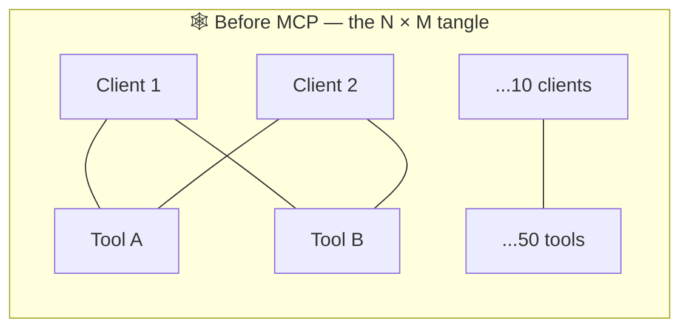

- Each AI app implements its own GitHub connector, Slack connector, Postgres connector…
- Tool authors must ship a different SDK for every client
- Changing one API breaks dozens of bespoke clients
- No standard for auth, schema discovery, capability negotiation
- **10 clients × 50 tools = 500 hand-written integrations**

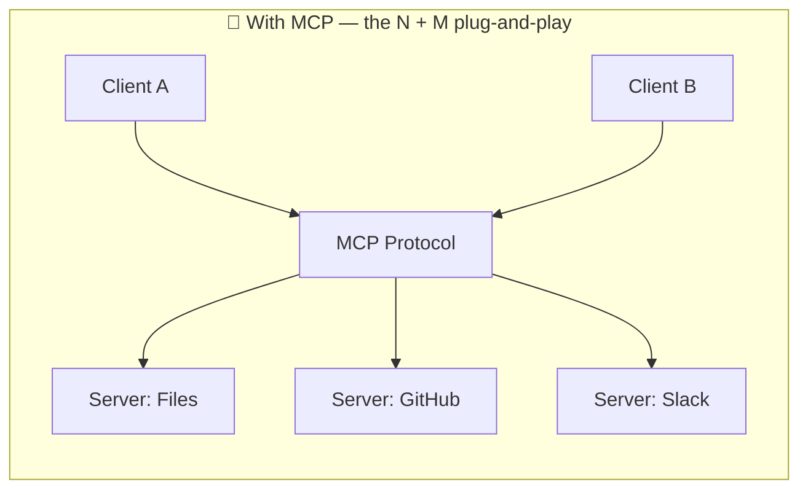

- Each tool ships **one** MCP server, usable by every MCP-compatible client
- Each AI app implements **one** MCP client, usable with every MCP server
- **10 clients + 50 tools = 60 implementations** — and they all interoperate
- JSON-RPC 2.0 + capability negotiation = standard discovery
- OAuth 2.0 (remote servers) = standard auth

> **The Core Insight: MCP = LSP for AI agents**
> The Language Server Protocol let any editor talk to any language tool with one standard. MCP does the same for AI applications and external data/tools.
> Anthropic's one-liner: **"A USB-C port for AI applications."** Build once, adopted everywhere.

---

## 2. What is MCP, Really?

### The three words — unpacked

| Word | Meaning |
|---|---|
| 🤖 **Model** | The LLM at the heart — GPT, Claude, Llama, DeepSeek. Powerful, but boxed in by training-cutoff knowledge and a finite context window. |
| 🧠 **Context** | Everything outside the weights — files, DB rows, API responses, user preferences, conversation history, RAG retrievals. Quality is bounded almost entirely by how good your context-management is. |
| 📡 **Protocol** | JSON-RPC 2.0 over stdio / HTTP+SSE — the standardised conversation. Defines how a client lists tools, calls them, subscribes to changes, negotiates capabilities — once, for the entire ecosystem. |

> **Analogy ladder**: HTTP standardised how browsers talk to servers. LSP standardised how editors talk to language tooling. **MCP standardises how AI applications talk to external data and tools.** MCP explicitly takes design inspiration from LSP.

### Why "context" is the whole game

Out of the box, every generative model is limited by its **pre-training cutoff**, its **token window**, and its **conversation history**. The way to push past those limits is to feed it the right context, on demand — in a structured, standardised, secure way. That's MCP.

---

## 3. MCP in Plain English — The 30-Second Restaurant Analogy

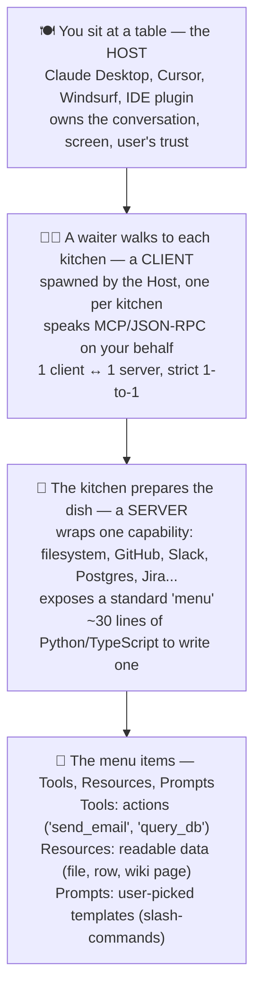

> **The one-line definition**: MCP is a standard way for an AI app to ask outside programs for context and to invoke actions — without bespoke integration code for every combination. Anthropic released it in **November 2024** (designed by Mahesh Murag).
>
> Think of it as **USB-C for AI**: one socket, many devices. Before MCP, every AI app needed custom glue code for every tool — the N×M problem. After MCP, build a server once, and any MCP-aware app can use it.

### One picture — the four roles together

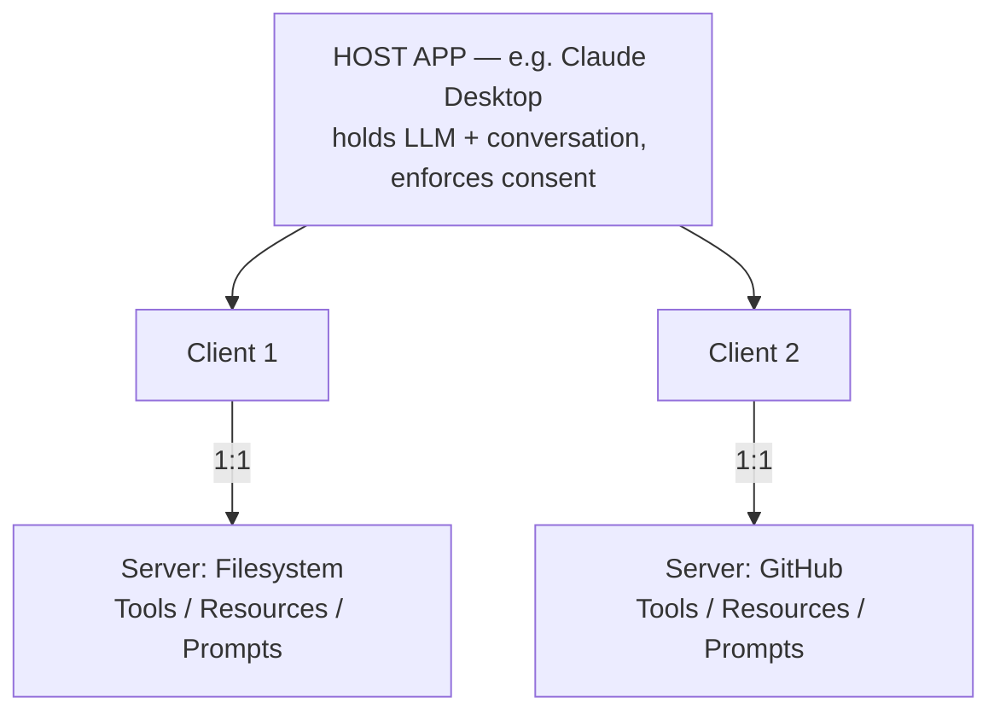

---

## 4. MCP vs RAG vs Tool Binding

### Evolution of LLM ↔ tool integration

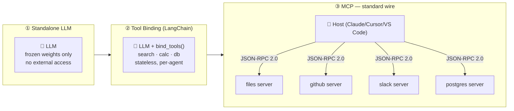

**Before**: N × M integrations → 10 clients × 50 tools = 500 bespoke connectors; every tool change ripples to every client.
**After**: N + M implementations → 10 clients + 50 tools = 60 implementations; any client × any server, plug-and-play.

### RAG vs MCP — Overlap and Difference

| | 📚 Traditional RAG (without MCP) | 🔌 MCP (with optional RAG inside a server) |
|---|---|---|
| Ownership | App manually owns vector store, embedder, retriever | App asks "give me context about X" — server decides how |
| Adding sources | Rewriting app code for each new doc source | Swap a document source by swapping the server, app untouched |
| Coupling | Each integration bespoke and tightly coupled | Standard Resources primitive — same shape for any data |
| Actions | Read-only retrieval — fetches text, can't take actions | Tools primitive enables actions (write file, send Slack, run query) |
| Protocol shape | One-shot per query, no bidirectional protocol | Bidirectional + stateful — supports memory, subscriptions, sampling |
| Implementations | Hard to swap without breaking the app | A RAG pipeline is one valid implementation *behind* an MCP server |

| Dimension | RAG | Tool Binding | MCP |
|---|---|---|---|
| **Primary purpose** | Inject text context | Let LLM call functions | Standardise both context + actions |
| **Scope** | Per app | Per agent/session | Whole AI ecosystem |
| **Direction** | One-shot retrieval | One-shot calls | Bidirectional, stateful |

---

## 5. Architecture — Host · Client · Server

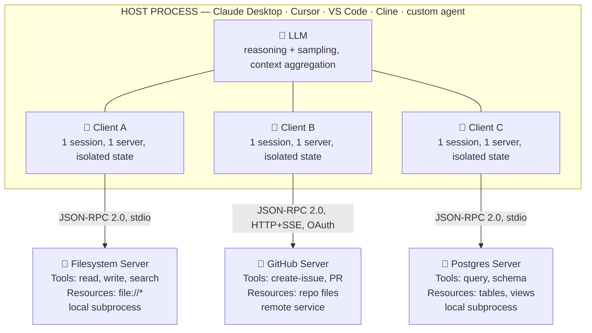

> ↑ **Trust boundary** — host enforces user consent, isolates servers from each other and from full chat history.

### Three roles

| Role | Responsibilities |
|---|---|
| 🏠 **Host** (the trust boundary) | Creates and supervises all clients; holds the LLM + full conversation history; enforces user consent before any tool call; aggregates context from multiple servers; coordinates sampling requests back to the LLM |
| 🔗 **Client** (one per server, isolated) | 1-to-1 stateful session with exactly one server; handles protocol negotiation + capability exchange; routes JSON-RPC messages bidirectionally; manages subscriptions/notifications; never sees other servers or full chat history |
| 🛠 **Server** (focused capability provider) | Exposes Tools, Resources, Prompts via MCP primitives; local subprocess (stdio) or remote service (HTTP+SSE); one focused responsibility; can be built by anyone; reusable across every MCP-compatible client |

---

## 6. The Three Server Primitives

| Primitive | Controller | Description | API |
|---|---|---|---|
| 🔧 **Tools** | **model-controlled** | Executable functions the LLM can call — side-effectful operations (query DB, send message, create file, hit API). Each has a name, JSON-schema input, description. LLM decides when to call based on context. | Discovered via `tools/list`, invoked via `tools/call`. Capability flag: `tools.listChanged`. Examples: `create_issue`, `send_email`, `run_query` |
| 📂 **Resources** | **application-controlled** | Read-only data with stable URIs — files, DB schemas, log streams, anything addressable. Host decides how to surface them (auto-include, user-pick, search). | Listed via `resources/list`, read via `resources/read`, optional `subscribe`. Examples: `file:///x`, `postgres://t/users` |
| 💬 **Prompts** | **user-controlled** | Parametrised prompt templates the user can pick — typically surfaced as slash commands. Server fills arguments and returns a structured message sequence. | Listed via `prompts/list`, retrieved via `prompts/get`. Examples: `/explain-code`, `/summarise-pr`, `/triage-bug` |

> **The Controller Matters**: Who decides when to invoke — model, app, or user? This single axis determines security, UX, and observability.
> - **Tools** are model-controlled (host must enforce user consent)
> - **Resources** are app-controlled (host UI shows them as a tree/list/auto-include)
> - **Prompts** are user-controlled (user explicitly fires them)
>
> Mixing these up is the #1 design mistake.

---

## 7. Client Features — Roots & Sampling

### 📁 Roots — file:// URIs the server may operate within

Clients tell servers "you can touch these directories, nothing else." A code-editor host might expose the open project folder; a desktop client might expose `~/Documents`.

- Listed via `roots/list`. Each root: `{ uri: "file:///path", name?: "Project" }`
- Notification: `roots/list_changed`
- **Hard boundary** — server cannot escape it

### 🧬 Sampling — server asks client to run the LLM

A server can request "please run this completion through your LLM and give me the result." The client controls model choice, approves the prompt, and decides what the server gets to see.

- Request: `sampling/createMessage`
- Client approves the prompt and the model
- **Server has zero credentials** — host pays for tokens
- Enables agents to call other agents recursively

### 🧩 Composability — any node can be both client and server

Client/server is a **logical role**, not a physical one. An orchestrator agent acts as a host to a research sub-agent (server) — and that sub-agent in turn acts as a host to a web-search server.

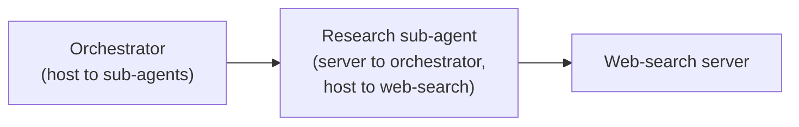

- Layered agent architectures — each layer is its own trust boundary
- Reuse third-party agents as MCP servers
- Specialise: orchestrator → researcher → fact-checker

---

## 8. Lifecycle & JSON-RPC Messages

### Session lifecycle — handshake, operation, shutdown

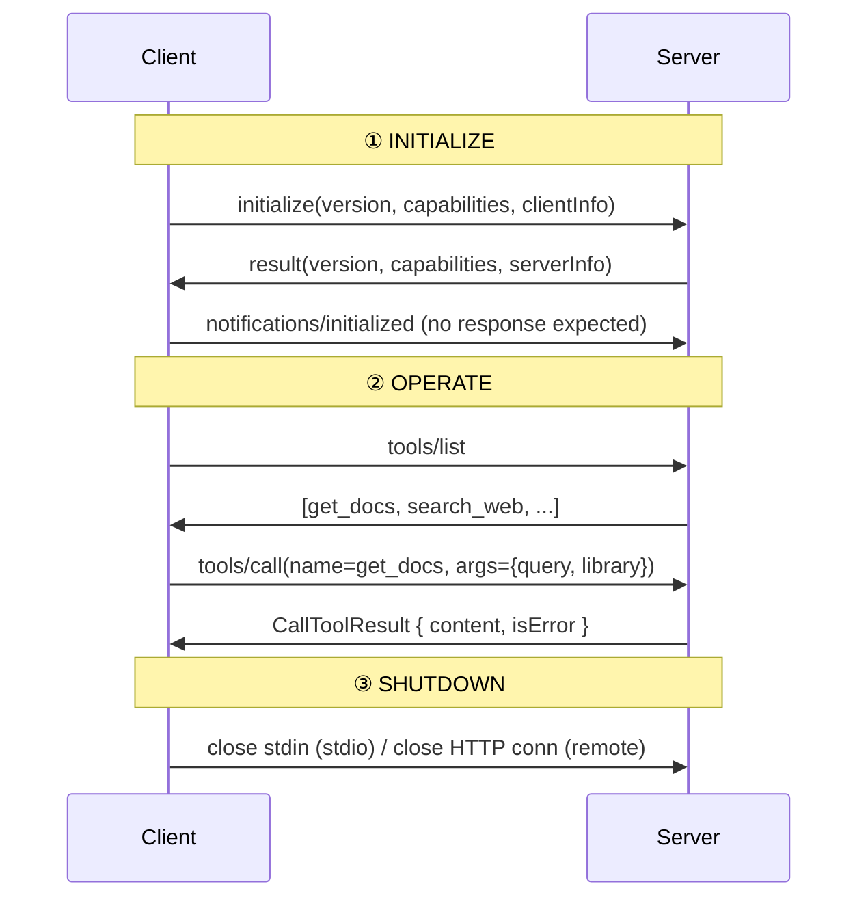

### The three JSON-RPC 2.0 message shapes

**↩️ Request** — bidirectional, expects a response:
```json
{
  "jsonrpc": "2.0",
  "id": 42,
  "method": "tools/call",
  "params": {
    "name": "get_docs",
    "arguments": { "query": "Chroma DB", "library": "langchain" }
  }
}
```

**✅ Response** — result or error, matches request id:
```json
{
  "jsonrpc": "2.0",
  "id": 42,
  "result": {
    "content": [{ "type": "text", "text": "Chroma is a vector DB..." }],
    "isError": false
  }
}
```

**📢 Notification** — one-way, no id, no response:
```json
{ "jsonrpc": "2.0", "method": "notifications/tools/list_changed" }
```
```json
{ "jsonrpc": "2.0", "method": "notifications/initialized" }
```

### Capability Negotiation

Each side declares what it supports — once, upfront. During `initialize`, the client declares features like `sampling` and `roots`; the server declares `tools`, `resources`, `prompts` and sub-flags like `resources.subscribe`. The session may only use what **both sides agreed on**.

This is why MCP evolves cleanly: a newer client can ignore unknown capabilities; an older server simply never advertises features it doesn't have.

---

## 9. Real Example — Claude Desktop + Filesystem MCP

| Step | Action |
|---|---|
| **1. Install** | Claude Desktop & Node.js — confirm Node is on PATH (`node --version` → `v20.11.0`); the official filesystem server runs via `npx` |
| **2. Enable Developer Mode** | Top-left Claude menu → Help → Enable Developer Mode. A new Developer tab appears in Settings |
| **3. Edit config** | Settings → Developer → Edit Config. Paste JSON, replace `username`, pick folders Claude is allowed to touch |
| **4. Restart** | Claude relaunches the server as a child process, talks via stdio. A 🔨 icon appears — server registered its tools |
| **5. Try it** | Ask Claude in plain English — it picks the right tool, asks for approval, executes |

```json
{
  "mcpServers": {
    "filesystem": {
      "command": "npx",
      "args": [
        "-y",
        "@modelcontextprotocol/server-filesystem",
        "C:\\Users\\username\\Desktop",
        "C:\\Users\\username\\Downloads"
      ]
    }
  }
}
```

```
tools/list → [read_file, write_file, move_file, search_files, list_directory, ...]
```

**Example interaction:**
```
you: Write a haiku about coffee and save it to my Desktop as coffee.txt
claude: [tool: write_file] → approve? ✓
claude: Done. Saved coffee.txt to ~/Desktop.

you: Move every .png on my Desktop to a new folder "Images"
claude: [tool: list_directory + move_file ×N] → approve? ✓
```

> **What just happened**: No glue code. Standard protocol. Real actions. You added a fully-functional file-management capability to a desktop LLM by editing one JSON file. The **same server** works in Cursor, Cline, and any other MCP-compatible client without modification.

---

## 10. Composability & Self-Evolving Agents

### An orchestrator agent that is itself a server — discovers new servers at runtime

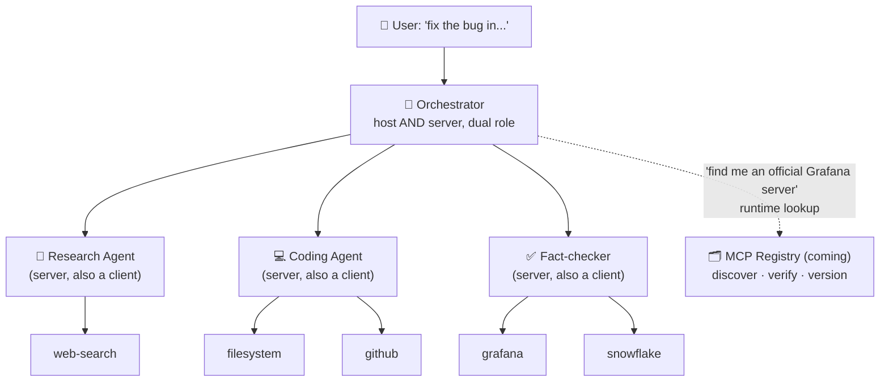

### 🧩 Composability
- Client/server is a logical role — any node can be both
- An orchestrator agent looks like a server to its caller and a host to its sub-agents
- **Sampling** lets sub-agents borrow the parent's LLM — zero API keys needed downstream
- Specialised agents (research, coding, fact-checking) compose like Unix pipes
- Third-party agents drop in unchanged — they speak MCP by default

### 🌱 Self-evolving agents
- Registry exposes all known servers + their capability schemas
- Agent encounters an unknown system → searches registry → installs/connects
- Example: coding agent hits a Grafana bug, discovers official Grafana server, queries logs
- Enterprises run private registries with whitelists for governance
- Versioning + OAuth 2.0 + verification badges close the trust loop

---

## 11. WebMCP — MCP for the Browser

### The problem WebMCP solves — agents reverse-engineering UIs

| Approach | Problems |
|---|---|
| **📸 Screenshot (Claude for Chrome, etc.)** | Agent captures the page as an image, vision model guesses where buttons/fields are by pixels. Every CSS animation/modal/layout shift breaks the agent. Huge token cost + multi-second latency. A 3-step task balloons into dozens of capture→infer→click loops. |
| **🕸 DOM parsing** | Agent slurps raw HTML, hunts for forms/buttons/links. SPAs emit thousands of nested nodes existing purely for layout. Class names like `.css-1a2b3c` tell the model nothing. DOM was designed to describe presentation, not capabilities. |

### The conceptual inversion

> **Stop making the agent guess. Have the website declare its tools.**
> Both legacy approaches force the AI to reverse-engineer capabilities from an interface designed for human eyes. WebMCP flips it: the page tells the agent "here are the things I can do, here are the parameters I need, here is how to invoke them." **Same inversion of control MCP did for servers — now in the browser.**

### Dual-layer web

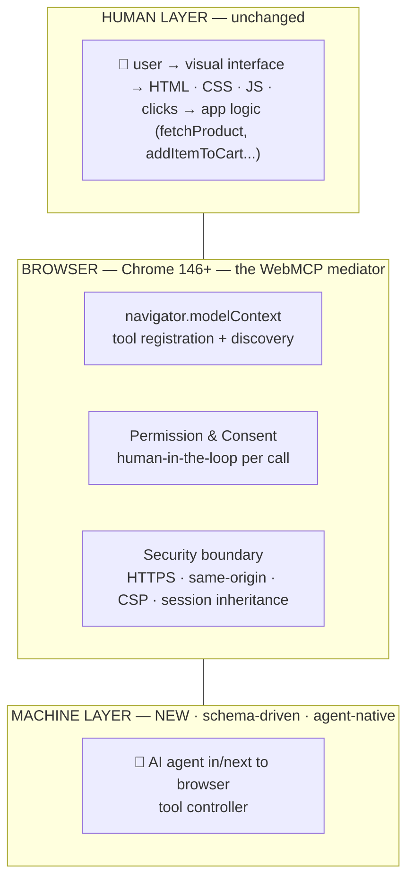

---

## 12. Security & Trust

### Four core principles

| # | Principle | Description |
|---|---|---|
| 1 | **User consent & control** | Every data access and tool invocation requires explicit user approval. Host UI must surface what is about to happen, in plain language. |
| 2 | **Data privacy** | The host never transmits resource data to other servers (or anywhere else) without user consent. Servers see only the slice of context they need. |
| 3 | **Tool safety** | Tools = arbitrary code execution. Treat unknown servers like running random scripts off the internet — because that's exactly what they are. |
| 4 | **Sampling controls** | When a server requests an LLM call, the user/client approves the prompt, picks the model, and decides what the server gets to see back. |

### Three commandments before installing any MCP server

1. **Read the source** (or trust the publisher). Official `@modelcontextprotocol/*` servers and verified vendor servers (Shopify, Grafana, GitHub) are safe defaults.
2. **Scope filesystem roots tightly** — don't hand a random server `/` or `C:\`.
3. **Use OAuth 2.0 for remote servers**; never paste long-lived API keys into a server config you didn't write.

---

## 13. Production Pitfalls

| Pitfall | Problem | Fix |
|---|---|---|
| **Tool description rot** | Vague descriptions → wrong tool gets called → silent quality loss | Write `USE FOR` / `DO NOT USE FOR` sections; include 3–4 example queries; test routing with real prompts |
| **Returning too much text** | A scraper returning 50KB per call burns the context window in three tool uses; conversation gets truncated | Truncate to ~4–8KB per result; paginate; return summaries with optional "fetch full" follow-up |
| **No timeouts on remote calls** | A slow upstream API blocks the whole tool call; client gives up; user sees "tool failed" with no detail | Wrap every HTTP call in `httpx` timeouts; return structured error objects with `isError: true` |
| **Secrets in config files** | Pasting `OPENAI_API_KEY=sk-...` into `claude_desktop_config.json` puts it in a world-readable file forever | Load secrets via `.env` + `python-dotenv`; for remote servers use OAuth 2.0; never commit configs |
| **Forgetting capability negotiation** | Calling `resources/subscribe` on a server that didn't declare `resources.subscribe` errors at runtime | Always check the `initialize` response capabilities map before calling optional features |
| **Servers reading whole conversation** | Slurping chat history into the server breaks isolation, leaks data, violates design principle | The host curates context. If you need state, store it under a server-owned URI and expose via Resources |
| **One mega-server with 50 tools** | LLM has to scan every tool description on every turn — routing degrades fast | Split into focused servers; one responsibility each |

---

## 14. What's Next — The 2026-07-28 RC

### Before RC vs After RC — where state lives

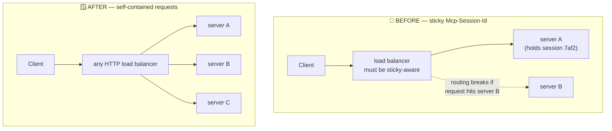

| | 🫥 Old shape — hidden in transport metadata | 🪟 New shape — visible handles in request body |
|---|---|---|
| Session handling | Server returned `Mcp-Session-Id`; client carries it | Server returns explicit handles: `basket_id`, `browser_id`, `repo_id` |
| Load balancing | Sticky-session LBs, shared session stores required | Model passes handles back in subsequent `tools/call` invocations |
| Workflow state | Invisible to the model — pure plumbing | State is part of agent reasoning — and the audit log |
| Gateway requirements | Gateways had to understand MCP to route correctly | Any instance handles any request — scales like normal HTTP |
| Ownership | — | Tool authors own scoping/validation/expiry of each handle |

```json
// step 1 — server returns a handle
{ "basket_id": "bkt_123" }

// step 2 — model passes it back, any server instance can serve this
{ "basket_id": "bkt_123", "item_id": "sku_456" }
```

### Extensions Framework

A real lifecycle for capabilities that aren't core: **reverse-DNS · own repo · own version**. Extensions get IDs, dedicated `ext-*` repos, delegated maintainers, and an `extensions` map negotiated during `initialize`. Core stays small; the ecosystem still experiments.

---

## See Also

- **[RAG — Zero to Hero](rag-zero-to-hero.md)** — the retrieval foundation that MCP servers often wrap
- **[Agentic RAG — Zero to Hero](agentic-rag-zero-to-hero.md)** — the agent patterns (planning, reflection, tool use, multi-agent) that MCP makes interoperable and easy to scale
