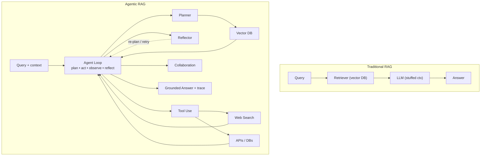
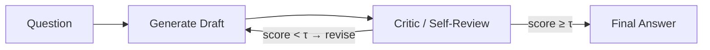
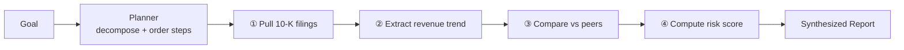
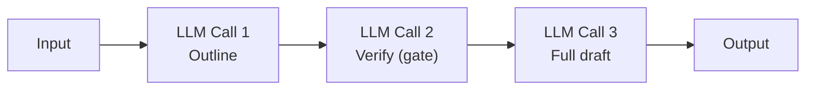
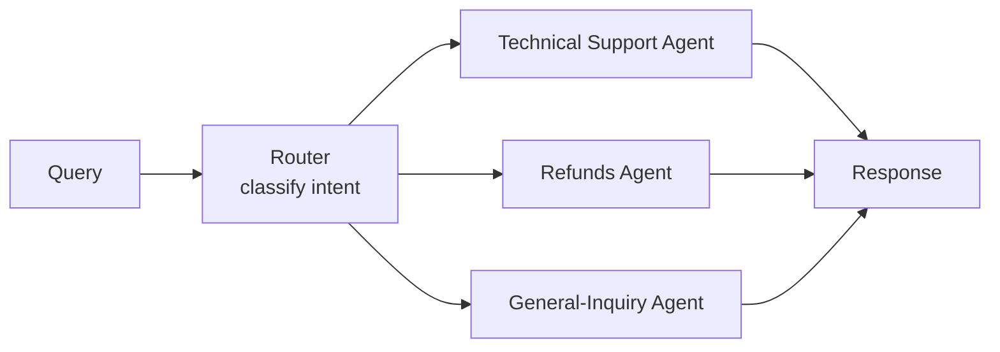
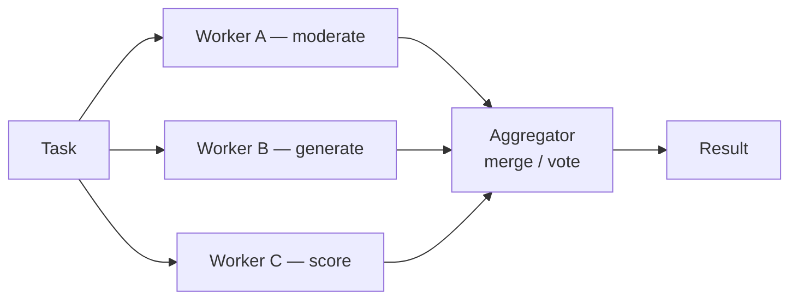
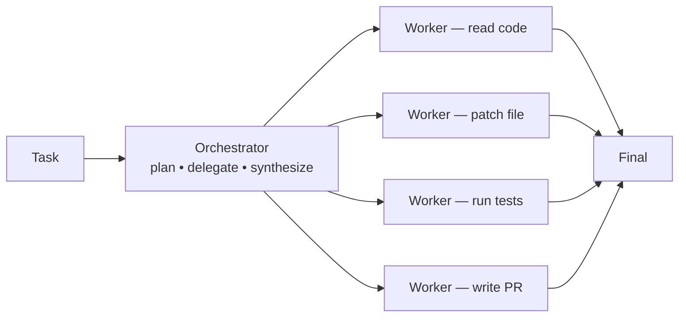
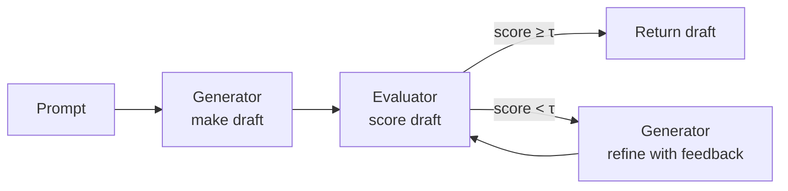
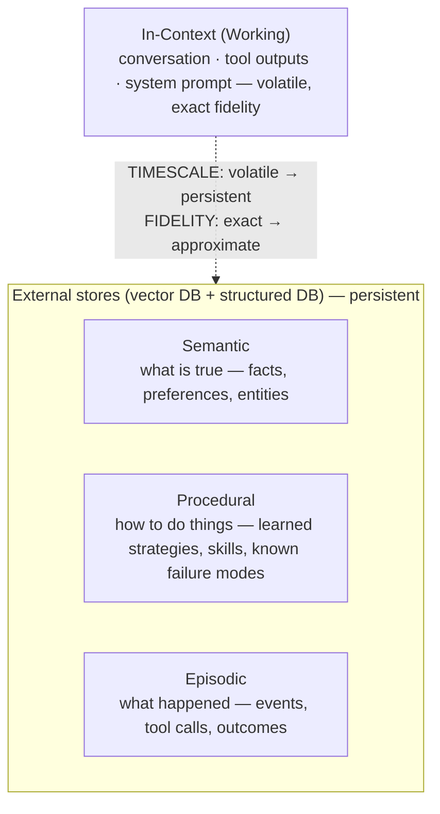
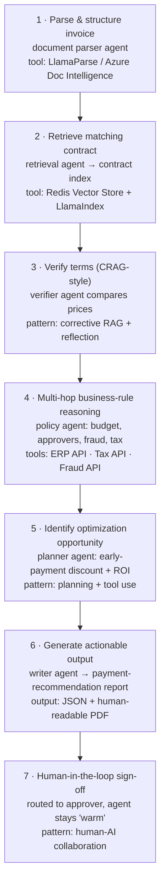

# Agentic RAG — Zero to Hero
### A Visual Deep Dive into Agent-Driven Retrieval Systems

---

## 1. What is Agentic RAG?

A vanilla RAG system is a **single shot**: `query → embed → retrieve → stuff into prompt → answer`.

It breaks down the moment a task needs **multi-hop reasoning**, **real-time tool calls**, **iterative correction**, or **coordination between specialists**.

**Agentic RAG** replaces that single-shot pipeline with one or more agents that own the workflow end-to-end.

| | **● Traditional RAG** | **★ Agentic RAG** | **▣ Agentic Document Workflows (ADW)** |
|---|---|---|---|
| Description | One-shot retrieval + generation | Agents orchestrate retrieval + reasoning | End-to-end document automation |
| Characteristics | Static pipeline, no self-correction, single index/query, limited multi-step reasoning | Plans & rewrites queries, reflects on output, uses tools/web search/APIs, multi-agent collaboration | Parses + structures docs, maintains state across steps, applies business rules, produces actionable output |

### Traditional RAG vs Agentic RAG control loop



*Figure: Traditional one-shot RAG vs. an Agentic RAG control loop with planning, reflection, and tool use.*

---

## 2. The Four Agentic Patterns

### 🔁 Pattern 01 — Reflection (the inner critic)

The agent grades its own output and refines until it clears an objective bar. "Draft → review → revise" baked into the model loop.



| Step | Action |
|---|---|
| 1. Draft | Generate the first attempt at an answer (or plan, or code) |
| 2. Self-evaluate | A critic prompt (or separate model) scores the draft against an explicit rubric — groundedness, completeness, format |
| 3. Decide | If score ≥ threshold → return. Otherwise capture critique as targeted feedback |
| 4. Refine | Feed feedback back into the generator. Loop with a hard cap (e.g. ≤3 iterations) |

- **Use when**: clear eval rubric, high-stakes/regulated output, mistakes are expensive
- **Avoid when**: tight latency budget (<1s), no good way to score quality, deterministic tasks
- **Real-world example**: **Self-RAG** (arXiv 2310.11511) — trains an LLM to emit special reflection tokens that gate retrieval and grade its own answer for groundedness.

```python
def reflect_answer(question, max_iters=3, tau=0.85):
    draft = llm.generate(question)
    for i in range(max_iters):
        review = critic.score(draft, rubric)
        if review.score >= tau:
            return draft
        draft = llm.refine(draft, review.feedback)
    return draft  # best-effort after cap
```

### 🗺️ Pattern 02 — Planning

A goal is decomposed into ordered steps by a planner, executed sequentially, and synthesized into a result.



### 🛠️ Pattern 03 — Tool Use
The agent can call external tools (search, calculators, APIs, code execution) as part of its reasoning loop, rather than relying purely on parametric knowledge.

### 🤝 Pattern 04 — Multi-Agent
Multiple specialized agents collaborate — each owning a narrow responsibility — coordinated by an orchestrator.

---

## 3. Agentic Workflow Patterns (5 Composable Building Blocks)

### 1 · Prompt Chaining — Accuracy Through Sequential Steps

Decompose a task into ordered steps; each step refines the output of the previous one. Trades latency for accuracy.



- **When to use**: Tasks with fixed, well-known sub-steps where each output cleanly feeds the next
- **Example**: Generate marketing copy in English → verify brand voice → translate to French preserving nuance
- **Real-world use case**: Document-creation pipeline (Anthropic cookbook) — outline → gate-check → expand. Measurably higher quality at 3× the calls.
- **Tradeoffs**: Latency High · Cost Med · Accuracy High

```python
outline = llm.call("Draft an outline for: " + topic)
if not validator.passes(outline):
    raise GateFailed(outline)
draft = llm.call("Expand this outline: " + outline)
final = llm.call("Polish for tone & brand voice: " + draft)
return final
```

### 2 · Routing — Send the Query to the Right Specialist

A classifier inspects the input and dispatches it to a specialized prompt, model, or sub-pipeline.



- **When to use**: Different input categories deserve distinct handling strategies or models of different cost/capability
- **Real-world use case**: Tiered model serving — ~70% simple FAQs → 7B local model (near-zero cost), ~25% → mid-tier, ~5% complex → GPT-class. Companies report **60–80% inference-cost reduction** with no measurable quality loss.
- **Tradeoffs**: Latency Low · Cost Low · Accuracy Med-High

```python
def route(query):
    label = classifier.predict(query)  # cheap, fast
    if label == "tech_support":
        return support_agent.handle(query)
    elif label == "refund":
        return refund_agent.handle(query)
    elif label == "complex":
        return big_model.handle(query)
    return small_model.handle(query)
```

### 3 · Parallelization — Speed & Confidence via Concurrency

Run independent sub-tasks at the same time (**sectioning**), or generate multiple candidate answers and vote (**voting**).



- **When to use**: Sub-tasks are independent (reduce latency), or multiple opinions raise confidence (voting)
- **Real-world use case**: Content moderation with voting (Anthropic) — three independent prompts each judge policy violation. System blocks only when ≥2 of 3 agree — drastically reducing false positives/negatives at the same wall-clock latency as one call.
- **Tradeoffs**: Latency Low · Cost High · Accuracy High

```python
async def judge(content):
    verdicts = await asyncio.gather(
        model_a.judge(content),
        model_b.judge(content),
        model_c.judge(content),
    )
    return majority(verdicts)  # 2-of-3 wins
```

### 4 · Orchestrator-Workers — Dynamic Task Delegation

A central orchestrator decides at runtime how to break the task down, delegates to specialist workers, then synthesizes.



- **When to use**: Sub-tasks are not known up front; orchestrator decides on the fly based on input complexity
- **Real-world use case**: Multi-source research agent — for "How are competitors pricing tractor part X?", orchestrator dynamically spawns workers: one searches news, one queries the catalog DB, one scrapes competitor sites, one summarizes earnings transcripts — merged into a comparison report.
- **Tradeoffs**: Latency Med · Cost Med-High · Accuracy High

### 5 · Evaluator-Optimizer — Iterative Quality Refinement



- **When to use**: Quality clearly improves with iteration AND you have an explicit evaluation rubric
- **Example**: Literary translation — generator drafts, evaluator scores fidelity + style; loop 2–3× until both metrics clear thresholds. Beats single-shot translation on long-form prose.
- **Tradeoffs**: Latency High · Cost High · Accuracy Very High

```python
def refine(prompt, max_iters=4, tau=0.9):
    draft = generator.make(prompt)
    for _ in range(max_iters):
        eval_ = evaluator.score(draft)
        if eval_.score >= tau:
            return draft
        draft = generator.make(prompt, feedback=eval_.critique)
    return draft
```

---

## 4. The Memory Layer

### Stateless LLM — "every call is a goldfish"

The model receives text, returns text, and **retains nothing**. No internal store is updated between calls.

| Symptom | Result |
|---|---|
| Double-books the calendar | Doesn't know what's scheduled |
| Resets tone & style every session | No user preferences |
| Repeats failed search queries | No memory of dead ends |
| Forgets mid-task discoveries | "file missing" lost on next call |

### Memory-Augmented Agent — behaves as if it remembers

A stack of in-context + external stores gives the stateless model the **illusion of persistent, queryable knowledge**:

- Reads & writes a calendar entity store before every booking
- Personalizes from a per-user preference profile
- Logs failed queries to episodic memory — won't retry blindly
- Persists mid-task facts to a scratchpad / blackboard

### The 4 questions that define the memory problem

| # | Question | Without it… |
|---|---|---|
| 1 | What happened before? | Double-booking, contradictions (calendar, ticket history, prior decisions) |
| 2 | What does this user want? | Agent feels generic on every turn (tone, format, language preferences) |
| 3 | What has the agent tried? | The same wall gets hit twice (failed queries, dead-ends, exceptions) |
| 4 | What facts accumulated? | Mid-task discoveries don't persist into the next step |

### The Memory Stack — four tiers



Production agents almost always combine **all four** tiers.

---

## 5. Taxonomy of Agentic RAG Systems

### 01 · Single-Agent RAG — Router-based (simplest agentic upgrade)

- **Idea**: One agent owns the entire flow — choose retriever, query it, generate answer
- **Workflow**: Query → agent classifies → agent picks tool (vector DB or web search) → retrieves → answers
- **Pros**: Easy to build & debug, low coordination overhead, cheap inference
- **Cons**: Doesn't scale to many tools, weak on multi-step reasoning
- **Best for**: FAQ chatbots, doc Q&A over one corpus, internal knowledge-base search
- **Real-world**: IBM Granite-3-8B knowledge assistant — LangChain + ChromaDB + Watsonx.ai, single agent routes between a vector index and web-search tool

### 02 · Multi-Agent RAG — Specialists Collaborating

- **Idea**: A team of agents, each with a narrow job, working on different parts of the same task
- **Workflow**: Coordinator splits the task → retriever-agent pulls docs → reasoning-agent analyses → synthesis-agent writes answer → results merged
- **Pros**: Modular & extensible, each agent stays focused, mix specialized tools
- **Cons**: Coordination cost grows fast, risk of redundant calls
- **Best for**: Multi-domain knowledge, cross-source synthesis, NL2SQL + RAG combos
- **Real-world**: **AgentFlow** — Planner · Executor · Verifier · Generator modules coordinate through evolving memory and integrated tools (`python_coder`, `google_search`, `wikipedia_search`); planner optimized with Flow-GRPO for long-horizon, multi-turn reasoning with sparse rewards

### 03 · Hierarchical Agentic RAG — Manager + Workers

- **Idea**: A top-level manager agent delegates to lower-level specialist agents and integrates their results
- **Workflow**: Manager plans → delegates to specialists → integrates outputs

---

## 6. Traditional vs Agentic vs ADW

| Feature | Traditional RAG | Agentic RAG | Agentic Document Workflows (ADW) |
|---|---|---|---|
| **Focus** | Isolated retrieval + generation | Multi-agent reasoning & tool use | Document-centric end-to-end ops |
| **Context maintenance** | Limited | Memory modules | State across multi-step workflow |
| **Dynamic adaptability** | Minimal | High | Tailored to document workflows |
| **Workflow orchestration** | None | Multi-agent orchestration | Multi-step document processing |
| **External tools/APIs** | Basic (vector DB) | Extensive (search, DBs, code) | Deep business-rule integration |
| **Scalability** | Small datasets | Multi-agent systems | Enterprise-scale documents |
| **Complex reasoning** | Simple Q&A | Multi-step | Structured across documents |
| **Primary apps** | QA, knowledge search | Multi-domain reasoning | Contracts, invoices, claims |
| **Strengths** | Simple, quick to build | Accurate, collaborative | End-to-end automation |
| **Challenges** | Weak context | Coordination complexity | Infra + domain standardization |

---

## 7. Where Agentic RAG Shines — By Industry

| Industry | Description | Patterns |
|---|---|---|
| 🩺 **Healthcare** | Clinical decision support fusing patient records, literature, trial data. Multi-hop reasoning across disease ↔ symptom ↔ treatment graphs | `graph-rag`, `corrective`, `multi-agent` |
| 🎓 **Education** | Personalized tutors that retrieve curriculum content, assess learner progress, generate adaptive practice — multiple agents simulate collaborative learning | `adaptive`, `multi-agent` |
| ⚖️ **Legal & Contracts** | Summarize contracts, surface risky clauses, cross-check precedents, flag compliance gaps — e.g. LawGlance (CrewAI + LangChain + Chroma), LlamaCloud Contract Review | `adw`, `hierarchical` |
| 💹 **Finance & Risk** | Financial summaries, real-time fraud detection across multiple signals, scenario-based risk modeling with graph workflows | `graph-rag`, `orch-workers` |
| 💬 **Customer Support** | Twitch used an agentic workflow with RAG on Amazon Bedrock to supercharge ad-sales — orchestrating CRM, content, and pricing tools to draft proposals | `multi-agent`, `routing` |
| 📄 **Document-Centric Ops** | Invoice payments, insurance claims, research-paper report generation — ADW patterns automate end-to-end workflows with state & business rules | `adw`, `evaluator-optimizer` |
| 🔬 **Scientific Research** | Combine structured experimental data with unstructured literature — graph-enhanced agents traverse citations and reason across modalities | `graph-rag`, `reflection` |

---

## 8. Worked Example — An ADW for Invoice Payments

**Scenario**: An accounts-payable team receives a PDF invoice from a tier-1 supplier. Instead of a clerk doing 6 manual steps, an ADW runs the workflow autonomously and ships a payment recommendation with citations in under a minute.



| Step | Agent | Action | Tools/Pattern |
|---|---|---|---|
| 1 | Document parser | Extract vendor, invoice #, line items, totals, payment terms (Net 30, 2/10 discount), PO ref | LlamaParse / Azure Document Intelligence |
| 2 | Retrieval agent | Query contract index for vendor + PO → master service agreement, pricing schedule, SLA | Redis Vector Store + LlamaIndex |
| 3 | Verifier agent | Compare invoice line items to contract pricing; if unit price exceeds contracted tier, grade evidence insufficient and re-query amendments | corrective RAG + reflection |
| 4 | Policy agent | Check budget allocation, approver delegation matrix, fraud-signal API (duplicate invoice #, abnormal amount), tax jurisdiction rules | ERP API · Tax API · Fraud API |
| 5 | Planner agent | Notice invoice qualifies for 2% early-payment discount (2/10 Net 30); compute ROI vs. cash-flow forecast | planning + tool use |
| 6 | Writer agent | Emit structured payment-recommendation report: amount, payment date, approver, savings, risk flags, inline citations | JSON + human-readable PDF |
| 7 | Human approver | Recommendation routed to right approver; agent stays "warm" for follow-up questions | human-AI collaboration |

---

## 9. Going Further

Once you've mastered the agentic patterns above, the natural next step is **[MCP (Model Context Protocol)](MCP-zero-to-hero.md)** — the standardized way agents connect to tools, APIs, and data sources without bespoke integration code. Agentic RAG patterns (reflection, planning, tool use, multi-agent) become dramatically easier to build and scale when every tool speaks a common protocol.

See also: **[RAG — Zero to Hero](rag-zero-to-hero.md)** for the retrieval foundation these agents build on top of.
