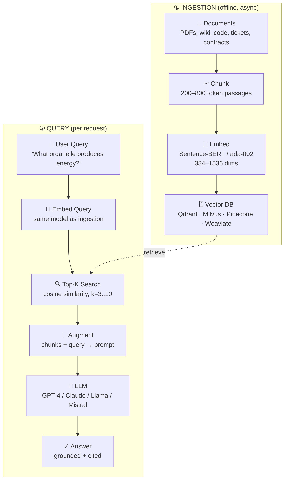
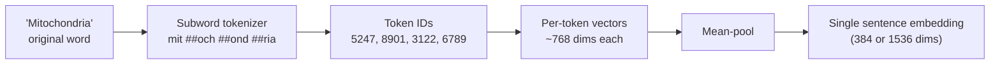
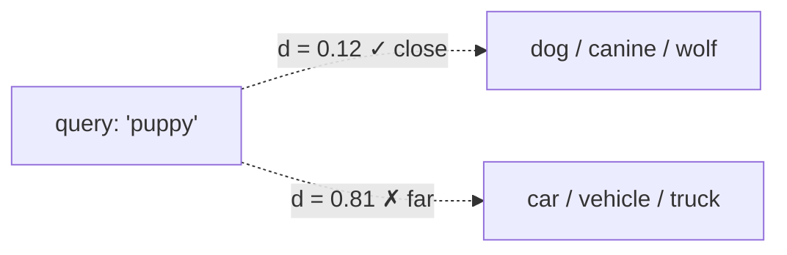
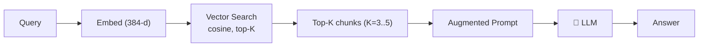
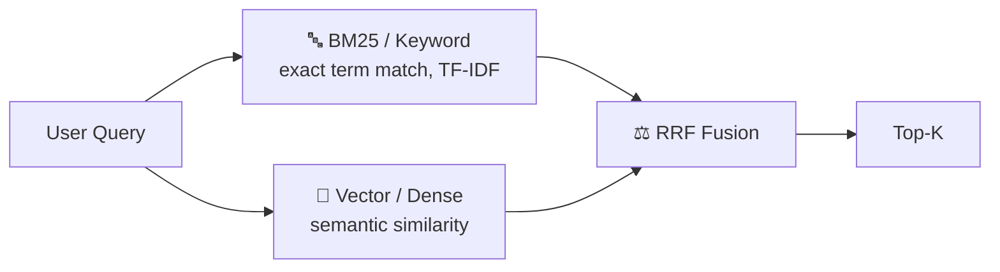
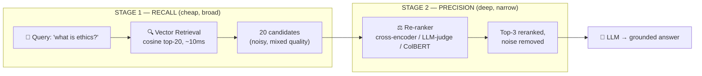
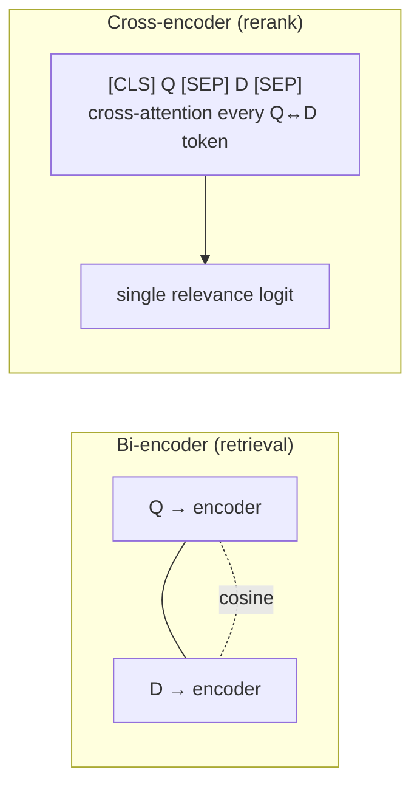

# RAG — Zero to Hero
### A Visual Deep Dive into Retrieval Augmented Generation

---

## 1. Why RAG Exists

LLMs trained on a fixed corpus suffer from four failure modes:

| # | Problem | Description |
|---|---------|-------------|
| 1 | **Stale knowledge** | An LLM trained in 2023 can't answer "Who won yesterday's match?" — its world ends at the training cutoff. |
| 2 | **Confident hallucination** | Asked about a topic outside its data, the model fabricates plausible-sounding but invented facts. |
| 3 | **No private knowledge** | Your company's wiki, contracts, code repo, and customer history were never part of pre-training. |
| 4 | **No citations** | Even when correct, the model can't point to a source — making it unusable for legal, medical, or regulated work. |

### LLM-only vs LLM + RAG

| | 🧠 LLM alone (parametric memory) | 🔗 LLM + RAG (parametric + retrieval) |
|---|---|---|
| Source of answers | Frozen training weights | Fresh chunks pulled from a vector store at query time |
| New/private data | No access | Indexes any private corpus — wiki, PDFs, tickets, code |
| Uncertainty handling | Hallucinates | Grounded — says "I don't know" when retrieval is empty |
| Updating knowledge | Requires retraining/fine-tuning | Re-index a document (seconds) |
| Citations | None | Every answer carries source citations |
| Cost of "knowing more" | Cost of retraining | Cost of one embedding call |

> **The Core Insight**
> **RAG = Search + Generation, glued by embeddings.**
> The LLM stays small and frozen. Knowledge sits in a searchable vector index. At query time, the most relevant chunks are retrieved and used to augment the prompt so the LLM generates a grounded answer.
>
> This simple pattern powers ChatGPT's browsing mode, GitHub Copilot Chat, Notion AI, Perplexity, and every enterprise "chat with your docs" tool.

---

## 2. The Simple RAG Pipeline

### End-to-end flow (ingestion meets query at the Vector DB)



### Stage-by-stage breakdown

| Stage | What happens | Tools / Notes |
|---|---|---|
| **1 · Load** | Pull source docs from S3, SharePoint, Confluence, Git. Strip boilerplate, preserve structure (headings, tables, code). | LangChain loaders, LlamaParse, Unstructured.io, PyMuPDF |
| **2 · Chunk** | Break long documents into passages (200–800 tokens) — small enough to embed, large enough to carry meaning. | Embedding models have a ~512 token ceiling |
| **3 · Embed** | Convert each chunk into a dense vector (384 or 1536 floats) capturing semantic meaning. | all-MiniLM-L6-v2, BGE-large, OpenAI text-embedding-3 |
| **4 · Store** | Persist vectors + original text in a vector DB with an ANN index (HNSW, IVF) for sub-100ms search. | **Always store original text** — embeddings aren't reversible |
| **5–6 · Embed Query** | At query time, embed the user's question with the **same model** used for ingestion. | Mismatched models = garbage results. Latency: 20–80ms |
| **7 · Retrieve top-K** | Find the K chunks whose vectors are closest to the query vector (cosine similarity / dot product). | Typical K: 3 (chat) – 20 (with reranker) |
| **8a · Augment** | Glue retrieved chunks into a prompt template: `Context: {chunks}\nQuestion: {q}` | Watch: total prompt must fit the LLM context window |
| **8b · Generate** | LLM reads context and writes a grounded, cited answer. | |

---

## 3. Embeddings & Tokenization

### Tokens are the atoms

"BPE", "WordPiece", and "SentencePiece" all shatter text into reusable subword pieces.



- Why subwords? A 30k vocabulary covers any English word. Rare words like "Mitochondria" decompose into known pieces.
- The `##` prefix in BERT marks "this token continues the previous one" — preserves the word boundary.
- ~4 chars ≈ 1 token for English. Code, emoji, and CJK are denser.
- **Same tokenizer everywhere**: the tokenizer used to embed your docs must match the one used at query time.

**Real impact** — Token count = cost & latency. A 500-page PDF that tokenizes to 250k tokens costs ~$2.50 just to embed once with OpenAI's ada-002. Pick a local model (all-MiniLM) for high-volume ingestion.

```python
from sentence_transformers import SentenceTransformer
model = SentenceTransformer("all-MiniLM-L6-v2")
tokens = model.tokenizer.tokenize("Mitochondria produce energy")
# → ['mit', '##och', '##ond', '##ria', 'produce', 'energy']
vector = model.encode("Mitochondria produce energy")
print(vector.shape)  # → (384,)
```

### Meaning becomes geometry

An embedding model maps text into a high-dimensional space where related concepts sit near each other. **Cosine similarity** = angle between vectors (1.0 = identical, 0 = unrelated, −1 = opposite).



Distance = (1 − cosine similarity). Words with similar meaning cluster together.

---

## 4. Chunking Strategies

| Strategy | How it works | Use when | Avoid when |
|---|---|---|---|
| **📏 Fixed-size** | Cut every N tokens (e.g. 500), ignoring meaning. ⚠ Sentences may split mid-clause — fix with overlap (e.g. 50 tokens). | Prototyping, uniform docs (logs, tweets), predictable throughput | Documents have clear structure, answers span paragraphs |
| **🧩 Semantic** | Embed each sentence, drop a boundary wherever similarity collapses (< 0.5). Keeps related ideas together. | Each chunk needs coherence, frequent topic shifts, quality > speed | Ingesting millions of docs (slow), short docs (< 1000 tokens) |
| **🌳 Hierarchical** | Preserve document tree (book → chapter → section → paragraph). Retrieve at multiple granularities. | Huge structured corpora (legal, technical manuals) | Flat/unstructured content |
| **🔀 Hybrid (Sliding-window)** | Fixed-size with overlap, tuned per content type. | Mixed corpora needing a balance of speed & coherence | — |

**Fixed-size chunking example:**

```python
def chunk_by_tokens(text, size=500, overlap=50):
    tokens = tokenizer.tokenize(text)
    chunks = []
    for i in range(0, len(tokens), size - overlap):
        chunk = tokens[i : i + size]
        chunks.append(tokenizer.decode(chunk))
    return chunks
```

**Real-world example (Fixed-size):** Slack message archive search — short uniform messages, no internal structure → 256-token fixed chunks with 32-token overlap works fine at 50k docs/min.

**Real-world example (Semantic):** Customer support knowledge base — long articles cover multiple problems. Semantic chunking keeps each "problem + solution" pair intact in one chunk → retrieval lands on a complete answer.

---

## 5. Five Types of Simple RAG

### 🟢 Naive (Vector-only) RAG



The textbook flavor: embed everything, semantic search, stuff into prompt. Done.

- **Best for**: Conceptual/paraphrased queries, FAQs, chatbots, small-to-mid corpora (< 1M chunks)
- **Weak at**: Exact-term queries (SKUs, error codes), acronym/proper-noun lookups
- **Production example**: Workspace-wide Q&A (Notion-class) — "How do we handle PTO requests?" surfaces the HR-handbook even though it says "vacation time approval workflow" — vocabulary bridging.

```python
chunks = load_and_chunk("docs/")
vectors = model.encode(chunks)
index.add(vectors, chunks)

def answer(query):
    qv = model.encode(query)
    top_k = index.search(qv, k=5)
    context = "\n".join(c.text for c in top_k)
    return llm(prompt(query, context))
```

### ⚖ Hybrid RAG (BM25 + Vector)



Combines keyword precision with semantic recall via Reciprocal Rank Fusion.

- **Best for**: Code search, legal/medical (exact terms), product catalogs (SKUs), acronym-heavy domains
- **Weak at**: Pure conversational chat, resource-constrained environments (2 indexes = 2× memory)
- **Production example**: Sourcegraph Cody — a query like "undefined behavior in memcpy" needs BM25 for the exact term and vector search for conceptual similarity.

### 🌳 Hierarchical RAG
Index documents at multiple levels of granularity (document → section → chunk). Retrieve at the level that best matches the query.

### 💡 HyDE (Hypothetical Document Embeddings)
For short queries against long documents, the LLM first **drafts a hypothetical answer**, embeds *that*, and searches for documents similar to the hypothesis — bridging the vocabulary gap between question and answer phrasing.

### 🪶 Reference-based (Lightweight) RAG
The vector DB stores only embeddings + stable references (IDs/offsets); the actual sensitive text (e.g. patient records) stays in its source-of-truth system. Useful for privacy/ACL-critical domains.

### At-a-glance: which type to pick

| RAG Type | Latency | Cost | Recall | Precision | Pick when… |
|---|---|---|---|---|---|
| Naive (Vector) | ~150ms | $ | good | good | You're starting out |
| Hybrid (BM25+Vec) | ~200ms | $$ | high | high | Exact terms matter (code, legal) |
| Hierarchical | ~250ms | $$ | high | high | Huge structured corpora |
| HyDE | ~700ms | $$$ | high | good | Short queries, long docs |
| Reference-based | ~250ms | $ | good | high | Privacy / ACL critical |

---

## 6. Vector Databases Compared

| Database | Best for | Deployment | Strengths | Tradeoffs | License |
|---|---|---|---|---|---|
| **Qdrant** | Production hybrid search | Self-host / Cloud | Rust-fast, rich filtering, hybrid built-in, generous free tier | Smaller ecosystem than Pinecone | Apache 2.0 |
| **Milvus / Zilliz** | Billion-scale corpora | K8s / Cloud | Horizontal scaling, GPU index, multiple ANN algorithms | Complex to operate at small scale | Apache 2.0 |
| **Weaviate** | Schema-first apps | Self-host / Cloud | Built-in vectorizers, GraphQL API, multi-tenancy | Tied to its own schema model | BSD-3 |
| **Pinecone** | Fully managed, zero-ops | SaaS only | Serverless, auto-scaling, "AWS of vector DBs" | Closed source, can get expensive | Proprietary |
| **pgvector (Postgres)** | Existing SQL workloads | Anywhere PG runs | Vectors next to relational data, transactional, free | Slower at >10M vectors, no native hybrid | PostgreSQL |
| **OpenSearch / Elastic** | Hybrid search at scale | Self-host / Cloud | BM25 + kNN in one engine, mature ops tooling | JVM overhead, requires tuning | Apache 2.0 / Elastic |

**Production hybrid query (OpenSearch DSL):**

```json
{
  "size": 10,
  "query": {
    "hybrid": {
      "queries": [
        { "match": { "chunk_text": "powerhouse of the cell" } },
        { "knn": { "chunk_vec": { "vector": [0.12, -0.45, "..."], "k": 10 } } }
      ]
    }
  },
  "search_pipeline": "rrf-pipeline"
}
```

---

## 7. Re-ranking — The Quality Control Layer

### The research-paper analogy
Writing a research paper, you first pull every source the catalog returns for your topic — that's **retrieval**. Then you critically read each one, checking credibility, depth, fit — that second pass is **re-ranking**. The LLM only sees the chosen few.

### The two-stage retrieval pattern



### Why bother? The measured impact

| Metric | Improvement |
|---|---|
| Answer accuracy (legal RAG) | 70% → 95% |
| Citation precision (academic) | +40% |
| End-to-end latency | −23% (less context = faster LLM) |
| Manual review time | −50% |
| Hallucinations | −30% |

### Why basic retrieval alone falls short

1. **Shallow semantic match** — embeddings score by overall vector closeness; miss subtle nuance ("not recommended" embeds close to "recommended").
2. **Dimensionality collapse** — compressing meaning to 384–1536 floats causes collisions between unrelated concepts.
3. **Domain drift** — embeddings perform best on data resembling their training set; out-of-domain corpora (legal, medical, code) tank recall.
4. **"Lost in the middle"** — LLM recall drops as more context is stuffed in. Top-20 unsorted > Top-3 reranked is almost never true.

### The five reranker families

| Reranker | Latency (top-20) | Quality | Cost | Setup | Pick when… |
|---|---|---|---|---|---|
| **BM25** | ~5ms | good | free | trivial | Keyword-heavy queries, edge devices |
| **Cross-Encoder (MiniLM)** | ~150ms | excellent | free | needs GPU at scale | Self-hosted high-quality RAG |
| **ColBERT / Multi-vector** | ~50ms | excellent | storage-heavy | moderate | End-to-end (no separate retriever needed) |
| **LLM-as-Judge (GPT-4)** | ~2–6s | SOTA | $$$ | just prompt | Eval / offline labelling / low QPS |
| **Cohere Rerank API / FlashRank** | ~40–200ms | excellent / very good | $1/1k or free | 1 line / pip install | Production default / chatbots, edge, no GPU |

**BM25 — probabilistic lexical scoring:**

```
score(D, Q) = Σ IDF(qᵢ) · (f(qᵢ,D)·(k₁+1)) ÷ (f(qᵢ,D) + k₁·(1 − b + b·|D|/avgdl))
```

Rewards term-density, penalizes long docs that just mention the word once.

```python
from rank_bm25 import BM25Okapi
top20 = vector_index.search(query, k=20)        # Stage 1
tokens = [d.text.split() for d in top20]
bm25 = BM25Okapi(tokens)
scores = bm25.get_scores(query.split())
ranked = sorted(zip(top20, scores), key=lambda x: -x[1])
top3 = [d for d, _ in ranked[:3]]                # Stage 2 done
```

**Cross-Encoder vs Bi-Encoder:**



### The decision tree in one sentence
**FlashRank for chat · Cohere for prod · Cross-encoder for self-hosted quality · LLM-as-judge for offline eval.** Most teams start with Cohere's managed API to prove value, then graduate to a self-hosted `bge-reranker-base` cross-encoder once cost/latency matters.

---

## 8. Where Simple RAG Ships Every Day

| Use case | Approach | Pattern types | Production examples |
|---|---|---|---|
| 💬 Customer support bots | Ingest help-center articles + past tickets, retrieve top-3, answer with citations | Naive, Hybrid | Intercom Fin, Zendesk AI, Salesforce Einstein |
| 💻 Code search & pair programming | Chunk by function, index repo + deps | Hybrid, Hierarchical | GitHub Copilot Chat, Sourcegraph Cody, Cursor |
| ⚖ Legal & contract Q&A | Hierarchical index of case law/contracts, cite case + paragraph | Hierarchical, Hybrid | Harvey AI, Spellbook, LawGlance |
| 🩺 Clinical decision support | Reference-based RAG keeps PHI in EHR; vector DB sees only embeddings | Reference-based, Hierarchical | Glass Health, Hippocratic AI, Microsoft DAX |
| 🛒 Product discovery / e-commerce | Embed descriptions + reviews, combine semantic + structured filters | Hybrid, Naive | Shopify Sidekick, Amazon Rufus, Mercari |
| 📚 Internal knowledge / wiki Q&A | Index Confluence/Notion/Docs, answer with source links | Naive, Reference-based | Glean, Notion AI, Microsoft 365 Copilot |
| 🔬 Academic research assistants | HyDE drafts a hypothesis → finds matching abstracts | HyDE, Hierarchical | Elicit, scite, Consensus, Semantic Scholar |
| 🌐 Search-augmented chat | Live-fetch web → chunk on the fly → embed → answer < 3s | Naive, HyDE | Perplexity, ChatGPT Browse, Phind, You.com |

---

## 9. Worked Example — A Real Query, End to End

**Scenario:** A 412-page biology textbook. Question: *"What organelle produces energy in human cells?"*

| Step | Detail |
|---|---|
| **1. Load & chunk** | PyMuPDF parses the PDF, strips headers/captions, sliding-window chunking (size=512, overlap=64). **Output**: 617 chunks `{chunk_id, text, page, vector_pending}` |
| **2. Embed (offline)** | `all-MiniLM-L6-v2` (80MB, CPU) → 384-dim vectors written to Qdrant. Throughput: ~1,200 chunks/sec. Index size: 924KB |
| **3. User asks** | "What organelle produces energy in human cells?" → tokenized to 9 tokens → query vector. Latency: 28ms (CPU embedding) |
| **4. Top-K search** | Qdrant HNSW returns 5 closest chunks in 8ms. **Top hit shares zero words with the query** — pure semantic match: <br>1. chunk #142 (sim=0.892, p.87) "Mitochondria are membrane-bound organelles…" <br>2. chunk #144 (sim=0.811, p.88) "ATP synthase complex…" <br>3. chunk #098 (sim=0.704, p.61) "Cellular respiration occurs in three stages…" <br>4. chunk #207 (sim=0.687, p.126) "Plant cells also contain chloroplasts…" <br>5. chunk #143 (sim=0.643, p.87) "Cristae…" |
| **5. Augment & generate** | Top chunks injected into prompt template; LLM produces a grounded, cited answer pointing to page 87. |

---

## 10. Production Pitfalls

| Pitfall | Problem | Fix |
|---|---|---|
| **Mismatched tokenizer/model** | Embedded with `bge-small` but query uses `ada-002` → vectors live in unrelated spaces, recall collapses to ~5% | Pin model name + version; re-embed everything if you change models |
| **Forgetting original text** | Embeddings aren't reversible — vector DB with only vectors can't show chunks to the LLM | Always store `{id, vector, text, source_uri, page}` together |
| **Chunk too big** | Most embedding models silently truncate at 512 tokens — 75% of a 2000-token chunk has zero influence | Check `model.max_seq_length`; size chunks ≤ that, with overlap |
| **No "I don't know" path** | LLM confidently makes things up when retrieval returns junk | Threshold on similarity (if top-1 < 0.5 → "couldn't find a reliable source"); prompt: "answer ONLY from context" |
| **Passing embeddings to the LLM** | LLMs accept tokens, not floats — vectors are index keys only | Retrieve `top_k.text`, not `top_k.vector`, into the prompt |
| **Stale/duplicated chunks** | Re-ingesting the same page nightly → 30 near-identical chunks crowd top-K, cost 6×, novelty drops to zero | Content-hash each chunk; upsert by hash; diff before reindexing |
| **No reranking when K is small** | Vector search ranks by coarse cosine similarity | Retrieve K=20 by vector, rerank to K=3 with a cross-encoder (70% → 90% precision) |
| **Stuffing too much context** | "Lost in the middle" effect degrades LLM recall and increases cost/latency | Keep context tight; rely on reranking, not brute-force breadth |

---

## Next Steps

This is **Simple RAG** — the foundation. Once you've mastered embeddings, chunking, retrieval, reranking, and production pitfalls, the next step is **[Agentic RAG](agentic-rag-zero-to-hero.md)**, where agents add planning, reflection, tool use, and multi-agent collaboration on top of this retrieval foundation — and **[MCP](MCP-zero-to-hero.md)**, the standard protocol that lets those agents talk to tools and data sources.
