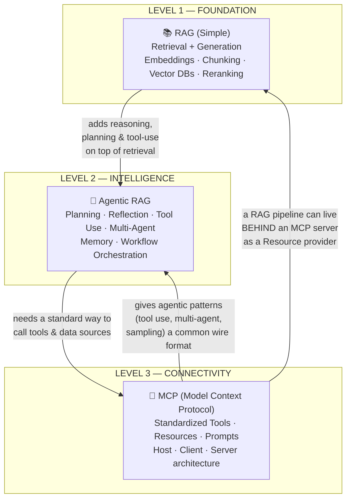
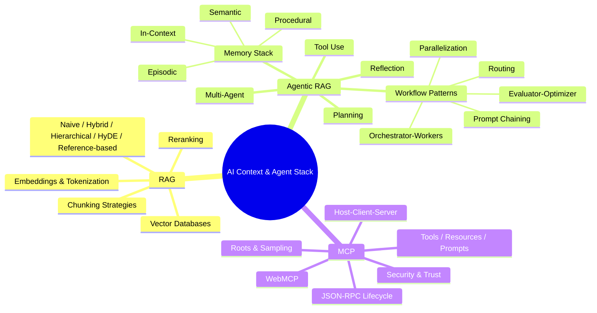
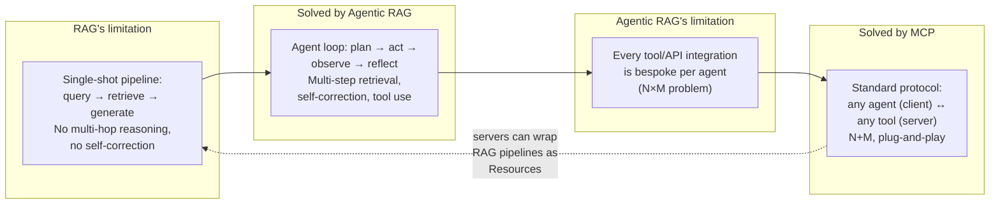
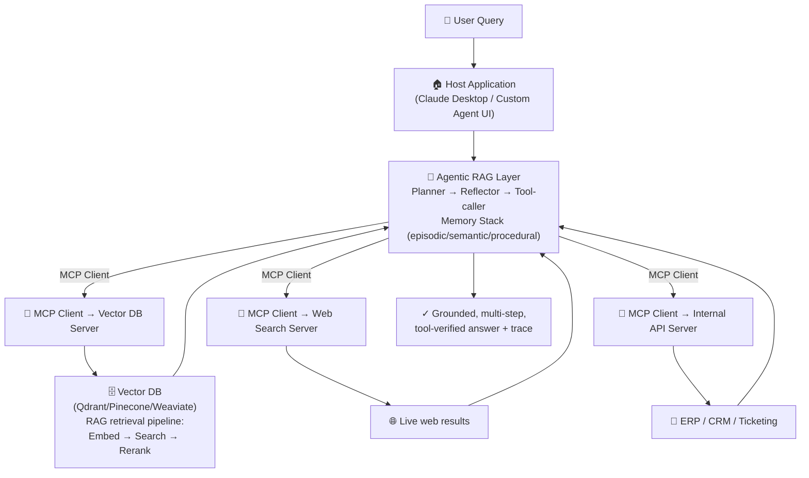
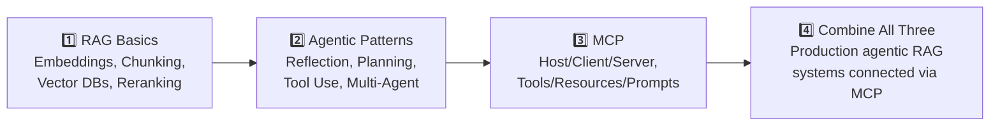

# RAG · Agentic RAG · MCP — Relevance Graph & Learning Map

This document visualizes how **RAG**, **Agentic RAG**, and **MCP** relate to each other conceptually, architecturally, and as a learning path.

---

## 1. The Big Picture — One Diagram

---

## 2. Conceptual Relevance Map

---

## 3. How They Solve Each Other's Limitations

---

## 4. Architectural Layering — How a Production System Combines All Three

**Reading this diagram:**
1. The **Host** (e.g., Claude Desktop) receives the user query.
2. The **Agentic RAG layer** plans the task, decides what context/tools are needed, and loops through reflection if needed.
3. Each external capability — a vector database, web search, or internal business system — is exposed via an **MCP server**, accessed through an **MCP client**.
4. The **RAG pipeline itself** (embedding → retrieval → reranking, from the first guide) lives *inside* the Vector DB MCP server as a Resource/Tool provider.
5. Results flow back through the agent's memory and reasoning loop to produce a final, grounded, cited answer.

---

## 5. Side-by-Side Comparison Table

| Dimension | RAG (Simple) | Agentic RAG | MCP |
|---|---|---|---|
| **Core question answered** | "How do I ground an LLM's answer in external knowledge?" | "How do I make retrieval & reasoning multi-step, self-correcting, and tool-using?" | "How do I let any AI app talk to any tool/data source without bespoke code?" |
| **Unit of work** | One-shot retrieve → augment → generate | Agent loop: plan → act → observe → reflect | Request/Response/Notification over JSON-RPC 2.0 |
| **Key components** | Embeddings, chunking, vector DB, reranker | Planner, Reflector, Memory stack, Multi-agent orchestrator | Host, Client, Server, Tools/Resources/Prompts |
| **State** | Stateless per query | Stateful via Memory Stack (episodic/semantic/procedural/in-context) | Stateful sessions (moving toward stateless/handle-based in 2026 RC) |
| **Failure mode addressed** | Hallucination, stale knowledge, no citations | Single-shot pipelines that can't handle multi-hop tasks | N×M integration explosion, fragmented tool access |
| **Released / popularized** | ~2020 (Lewis et al., "Retrieval-Augmented Generation" paper) | 2023–2025 (Self-RAG, ReAct, AutoGPT-style agents) | November 2024 (Anthropic) |
| **Analogy** | "Open-book exam" for the LLM | "A researcher with a notebook and a plan" | "USB-C port for AI applications" |

---

## 6. Suggested Learning Path (Recap)

| Stage | Read | Focus |
|---|---|---|
| 1 | [RAG — Zero to Hero](rag-zero-to-hero.md) | Understand retrieval fundamentals: how LLMs get grounded in external data |
| 2 | [Agentic RAG — Zero to Hero](agentic-rag-zero-to-hero.md) | Learn how agents add reasoning, planning, memory, and tool use on top of RAG |
| 3 | [MCP — Zero to Hero](MCP-zero-to-hero.md) | Learn the standard protocol that lets agents connect to tools and data sources |
| 4 | — | Combine: build agentic RAG systems where every external capability (vector DB, APIs, web search) is exposed as an MCP server |

---

## 7. Quick-Reference Glossary Across All Three Guides

| Term | Appears In | Definition |
|---|---|---|
| **Embedding** | RAG | Dense vector representation of text capturing semantic meaning |
| **Reranker** | RAG | Second-stage model that re-scores retrieved candidates for precision |
| **Reflection** | Agentic RAG | Agent self-critiques and revises its own output in a loop |
| **Orchestrator** | Agentic RAG, MCP | A coordinating agent/process that delegates to specialist workers or servers |
| **Memory Stack** | Agentic RAG | Episodic, semantic, procedural, and in-context memory tiers |
| **Tool** | Agentic RAG, MCP | A callable function/action the model or agent can invoke |
| **Resource** | MCP | Read-only addressable data exposed by an MCP server |
| **Sampling** | MCP | A server asking the client to run an LLM completion on its behalf |
| **JSON-RPC 2.0** | MCP | The wire protocol underlying all MCP communication |
| **HyDE** | RAG | Hypothetical Document Embeddings — draft a hypothetical answer to bridge query/document vocabulary gaps |
| **ADW** | Agentic RAG | Agentic Document Workflows — end-to-end document automation with state and business rules |
